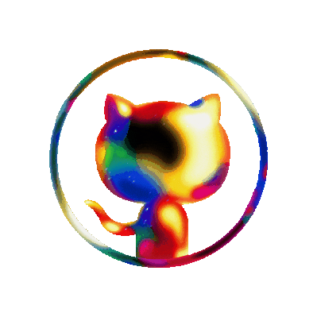
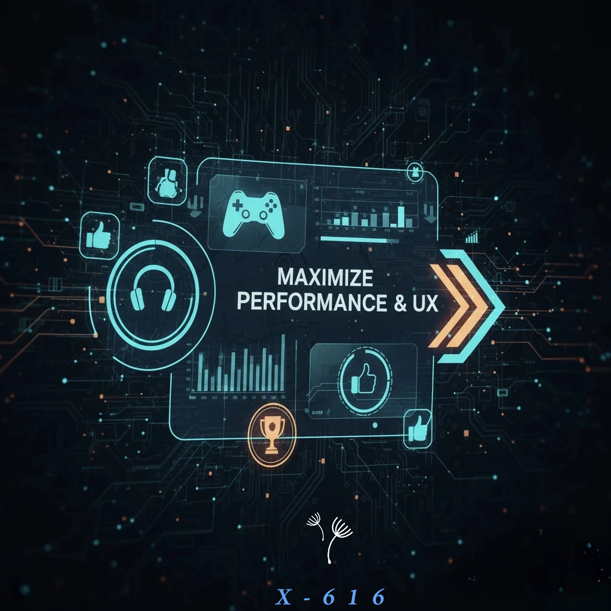
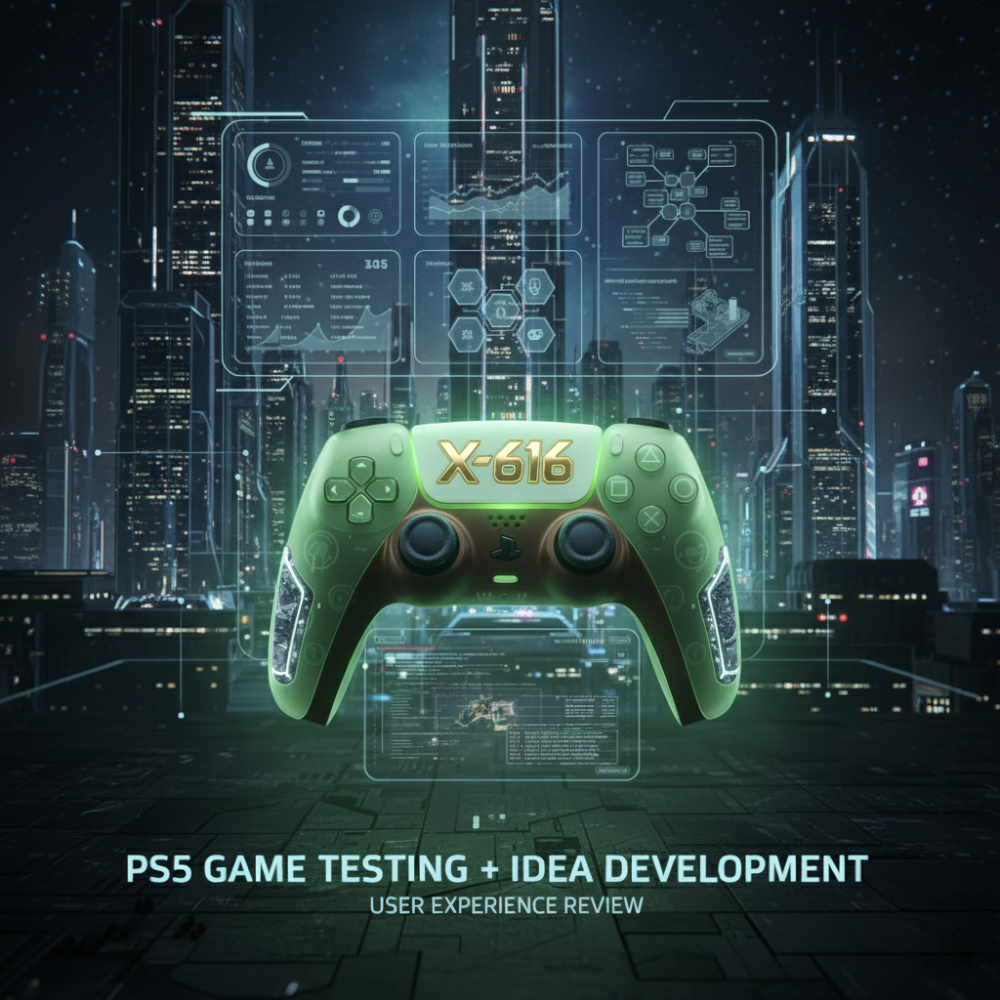
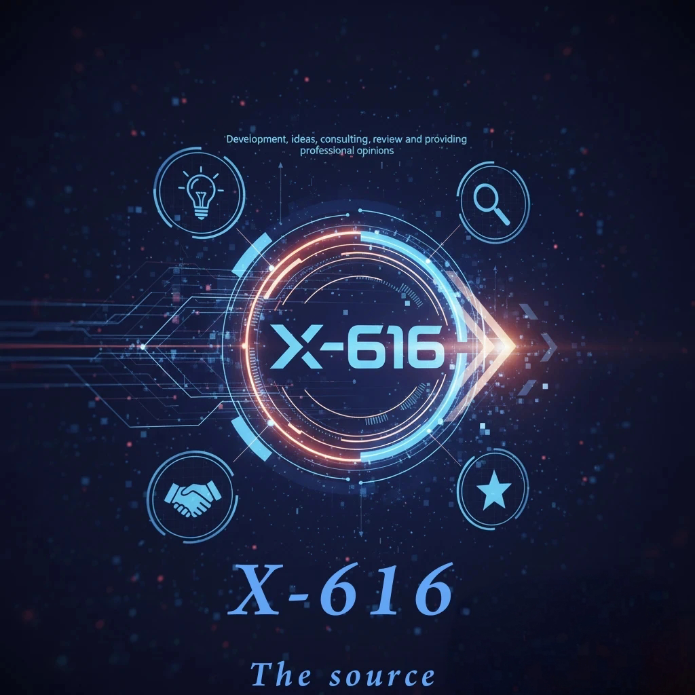
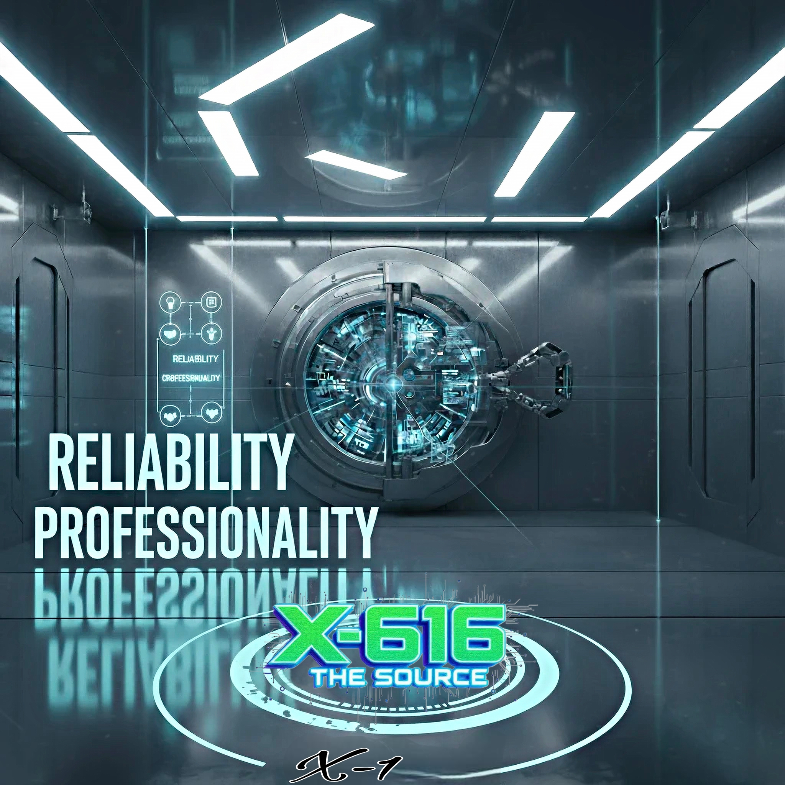
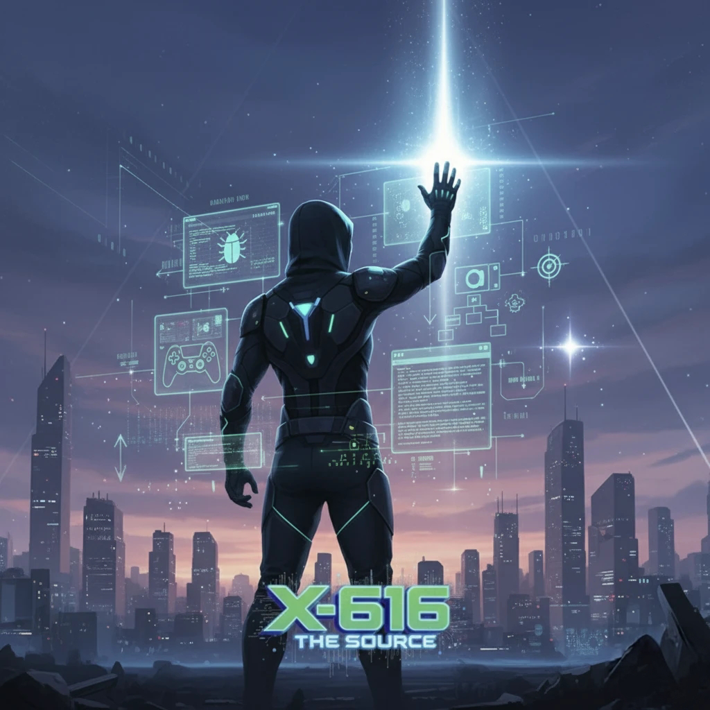

## 💎-𝔓𝔯𝔦𝔳𝔞𝔱𝔢 𝔊𝔢𝔫𝔢𝔯𝔞𝔩 ℭ𝔬𝔫𝔰𝔲𝔩𝔱𝔞𝔫𝔱 ^∞^ 𝖃-616.👋
🄿🄷🄴🄽🄾🄼🄴🄽🄾🄽 ***⚚ ⚚ ⚚***

---

  

  <b>Strategic Deep-Dive: The Decline of Tech & Entertainment</b>

---

  
  
  
  

---

⚡🅜🅐🅧🅘🅜🅘🅩🅔 🅟🅔🅡🅕🅞🅡🅜🅐🅝🅒🅔 & 🅤🅧

✨ Expert B2B consultant for optimizing technological performance & app efficiency. 🚀 Provides comprehensive 👩🏻‍💻 QA/QC services & sharp User Experience (UX) reviews for gaming & digital media products. 🎯 Transforms your development into a product with uncompromised, high-quality end-user experience.

🅜🅐🅡🅚🅔🅣 🅥🅘🅐🅑🅘🅛🅘🅣🅨 🅐🅝🅐🅛🅨🅢🅘🅢

---

**Product Direction, ⓘⓓⓔⓐⓢ💡, 𝕔𝕠𝕟𝕤𝕦𝕝𝕥𝕚𝕟𝕘, 𝕣𝕖𝕧𝕚𝕖𝕨 𝕒𝕟𝕕 𝕡𝕣𝕠𝕗𝕖𝕤𝕤𝕚𝕠𝕟𝕒𝕝 𝕠𝕡𝕚𝕟𝕚𝕠𝕟𝕤.** -🅧- ❻ ❶ ❻ (Product, Review, 🅃🄾 🄰 🅆🄷🄾🄻🄴 🄽🄴🅆 🄻🄴🅅🄴🄻)

---

**PS5 - 🎮 - Game testing 💽 + 🔬, idea development-💻^∞^ᐃ , user experience review📊.🟢**

---

🎬 **Movies: The Viewing Experience** 😎 Reviews & Insights 📊

---

**Technology | UX • Prototyping • Strategy 💻**

***Bringing ideas to life, from code to promotion. 🚀 🚀 🚀 🔭 🎮 📱 💻 👩🏻‍💻 🔎 📐***

---

▌│█║▌║▌║ Support and promotion of an idea💡 or product. ║▌║▌║█│▌ -🅧- ❻ ❶ ❻

---

## 👻 𝔽ℝ𝕆𝕄 𝕋ℍ𝔼 𝕊ℍ𝔸𝔻𝕆𝕎𝕊 ℂ𝕠𝕟𝕗𝕚𝕕𝕖𝕟𝕥𝕚𝕒𝕝 ℂ𝕠𝕞𝕞𝕚𝕥𝕞𝕖𝕟𝕥 🛡️⚔️🛡️

***𝕋𝕙𝕖 𝕤𝕖𝕣𝕧𝕚𝕔𝕖 𝕚𝕤 𝕡𝕣𝕠𝕧𝕚𝕕𝕖𝕕 '𝕗𝕣𝕠𝕞 𝕥𝕙𝕖 𝕤𝕙𝕒𝕕𝕠𝕨𝕤' 𝕨𝕚𝕥𝕙 𝕔𝕠𝕞𝕡𝕝𝕖𝕥𝕖 𝕒𝕟𝕠𝕟𝕪𝕞𝕚𝕥𝕪***

**𝔼𝕧𝕖𝕣𝕪 𝕚𝕕𝕖𝕒, 𝕕𝕖𝕧𝕖𝕝𝕠𝕡𝕞𝕖𝕟𝕥, 𝕒𝕟𝕕 𝕚𝕟𝕥𝕖𝕝𝕝𝕖𝕔𝕥𝕦𝕒𝕝 𝕡𝕣𝕠𝕡𝕖𝕣𝕥𝕪 𝕓𝕖𝕝𝕠𝕟𝕘𝕤 𝕖𝕩𝕔𝕝𝕦𝕤𝕚𝕧𝕖𝕝𝕪 𝕥𝕠 𝕥𝕙𝕖 𝕔𝕝𝕚𝕖𝕟𝕥.***

🅞🅤🅡 🅒🅞🅜🅜🅘🅣🅜🅔🅝🅣🅢: 🔑🗝️

✅ **🅣🅞🅣🅐🅛 🅒🅞🅝🅕🅘🅓🅔🅝🅣🅘🅐🅛🅘🅣🅨** – guaranteed and signed  
✅ **Strict Non-Disclosure Agreement (ⓃⒹⒶ)**  
✅ **Complete Anonymity** – we operate behind the scenes

The service is provided 'from the shadows' with complete anonymity. Every idea, development, and intellectual property belongs exclusively to the client. We are committed to total confidentiality, secured and signed in a strict Non-Disclosure Agreement ✅(NDA)✅. 🛡️⚔️🛡️

---

## 🅰🅱🅾🆄🆃 🅼🅴 ^∞^

A simple person who likes to learn everything possible

***~~<💚>~~*** ^∞^_🅷🅾🅱🅱🅸🅴🆂: 𝚆𝚛𝚒𝚝𝚒𝚗𝚐 𝚜𝚌𝚛𝚒𝚙𝚝𝚜 + 𝐓𝐞𝐫𝐦𝐮𝐱, 𝒔𝒐𝒇𝒕𝒘𝒂𝒓𝒆, 🅣🅞🅞🅛🅢, ⓟⓢ⑤, ᖇEᔕEᗩᖇᑕᕼ, and more. ***~~<💚>~~***

---

## ✦✧✧Ⓑ-Beta and not Ⓓ-data. ✖◕‿◕✖™

© This saying was invented by 🅧-❻❶❻.

---

## 📩 Get in Touch

Since GitHub doesn't support direct messaging, the best way to reach me for collaborations, consulting, or inquiries is to open a new Issue in my [Contact Repository].

I'm always active and will get back to you as soon as possible.

**Let's bring your vision from the shadows into the light.**

---

𝔽𝕠𝕔𝕦𝕤: ℙ𝕣𝕠𝕕𝕦𝕔𝕥 𝔸𝕟𝕒𝕝𝕪𝕤𝕚𝕤 & 𝕊𝕥𝕣𝕒𝕥𝕖𝕘𝕪 | ℕ𝕠𝕥 𝕒 𝕤𝕠𝕗𝕥𝕨𝕒𝕣𝕖 𝕕𝕖𝕧𝕖𝕝𝕠𝕡𝕖𝕣.

---

> 💬 **My Philosophy:** I believe that partnerships and high technology value are more important than any monetary reward. Open to collaboration and helping out with projects that matter. Let's focus on the creative. 🚀

**--> --> 🔭 🎮 📱 💻 👩🏻‍💻 🔎 📐**

---

  

  <b>Strategic Deep-Dive: The Decline of Tech & Entertainment</b>

---

  
<b>🎮 Phase 1: Sony PlayStation – The Innovation Paradox (Click to Expand)</b>

  <blockquote>
    <b>The Golden Era (PS1–PS3):</b> Defined by high-risk, high-reward evolution. Each console generation represented a genuine cultural and technological leap that redefined gaming.  
    <b>The PS5 Reality:</b> Despite raw hardware superiority, the current era prioritizes "Safe Growth." It is a highly polished, clinical experience, but it lacks the experimental soul and creative risks that once drove the brand.
  </blockquote>

  
<b>🎬 Phase 2: Modern Media & The MCU (Click to Expand)</b>

  <blockquote>
    <b>Agenda vs. Art:</b> A systemic shift by major studios from character-driven, epic storytelling toward rigid ideological frameworks, causing a profound disconnect with long-term audiences.  
    <b>The Quality Gap:</b> When the "message" supersedes the plot, the core narrative inevitably breaks down, sacrificing timeless storytelling for temporary compliance.
  </blockquote>

  
<b>🍎 Phase 3: Apple's Iterative Engineering (Click to Expand)</b>

  <blockquote>
    <b>Cosmetic Progress:</b> Apple has mastered the art of rebranding minor hardware tweaks—such as incremental lens shifting—as "groundbreaking" technological revolutions.  
    <b>The Optimization Mantra:</b> Operating on a strict "Don't innovate if you can just optimize" playbook, the brand relies on ecosystem lock-in and fierce consumer loyalty rather than true disruption.
  </blockquote>

  
<b>🌐 Phase 4: Google – The Safety Handbrake (Click to Expand)</b>

  <blockquote>
    <b>The "Don't Be Evil" Genesis:</b> Google initially conquered the digital landscape through total openness. The open-source nature of Android was the catalyst for its global dominance, proving that ecosystem freedom drives massive success.  
    <b>The AI Gridlock:</b> While the generative AI race put Google back on the cutting edge, corporate risk-aversion is actively holding them back. Instead of delivering a futuristic, unhindered tool, they are choking their own products with restrictive permissions, corporate hesitation, and artificial limitations.
  </blockquote>

---

<h1 align="center">🛸 The Illusion of Progress</h1>

  

---

🎮 **Phase 1: Sony PlayStation** – A shift from creative boldness and high-risk evolution during the Golden Era (PS1–PS3) to a highly polished and clinical, yet soulless experience on the PS5 that prioritizes "Safe Growth."

🎬 **Phase 2: Modern Media & The MCU** – A transition from character-driven, epic storytelling to rigid formulas, focus groups, and ideological frameworks, causing a growing disconnect with long-term audiences.

🍎 **Phase 3: Apple** – Optimization over innovation. Mastering the art of rebranding minor hardware tweaks (such as incremental lens shifting) as "revolutionary" to keep consumers locked inside a captive ecosystem.

🌐 **Phase 4: Google** – Moving away from the total openness of its early era to actively choking its own AI tools out of regulatory fear, corporate hesitation, and artificial limitations.

---

### 🏁 Summary of Findings (My Personal Perspective)

Looking at the bigger picture, my conclusion is that we are living in an era defined by **"The Illusion of Progress."** Mainstream giants have fallen victim to their own success—their core motive has shifted from conquest to defense. They are no longer trying to amaze us; they are just trying to protect the status quo and satisfy shareholders with a safe, predictable **5%** quarterly growth.

But innovation isn't dead; it has simply moved elsewhere. While massive corporations suffocate their own products out of fear, the real action has shifted to smaller, agile companies on the fringes of the market: from the indie gaming industry to focused, sharp, and specialized AI applications. Today, the giant corporations provide only the boring infrastructure, while the creative spark has completely migrated to those who have nothing to lose.

---

  

---

  <b>🔒 Classified • 
Need-to-Know Basis • 𝕏-616 🔒</b>

